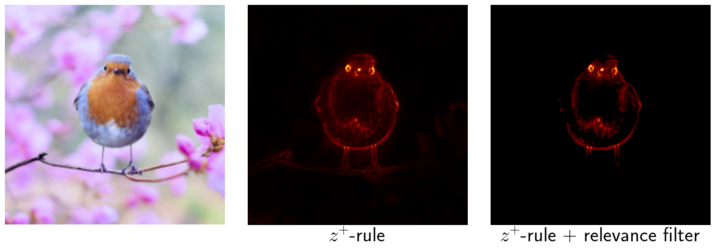
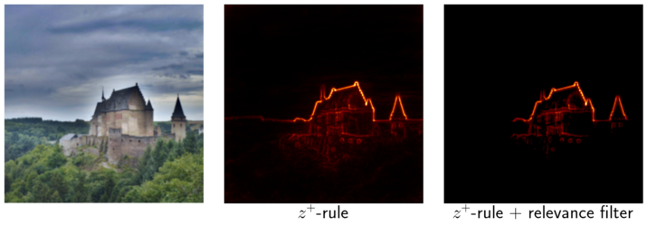
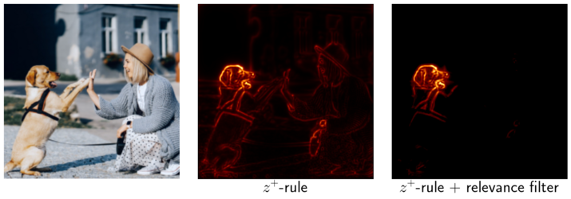

# Layer-wise Relevance Propagation (LRP) in PyTorch

Basic unsupervised implementation of Layer-wise Relevance Propagation ([Bach et al.][bach2015], 
[Montavon et al.][montavon2019]) in PyTorch for VGG networks from PyTorch's Model Zoo. 
[This][montavon_gitlab] tutorial served as a starting point. 
In this implementation, I tried to make sure that the code is easy to understand and easy to extend to other 
network architectures.

I also added a novel relevance propagation filter to this implementation resulting in much crisper heatmaps 
(see my [blog][blog] for more information). 
If you want to use it, please don't forget to cite this implementation.

This implementation is already reasonably fast. 
It is therefore also suitable for projects that want to use LRP in real time.
Using a RTX 2080 Ti graphics card I reach 53 FPS with the VGG-16 network.

If I find the time, I will provide a more model agnostic implementation. 
I also welcome pull requests improving this implementation.

You can find more information about this implementation on my [blog](https://kaifabi.github.io).

### To run

Running LRP for a VGG-like network is fairly straightforward

```python
import torch
import torchvision
from src.lrp import LRPModel
x = torch.rand(size=(1, 3, 224, 224))
model = torchvision.models.vgg16(pretrained=True)
lrp_model = LRPModel(model)
r = lrp_model.forward(x)
```

### Examples

Examples show the $z^+$-plus-rule without and with additional relevance filter.







### TODOs

- Add support for other network architectures (model agnostic)
- Add control for layer parameters via config file.
- Add control for relevance filter via config file.

### License

MIT

### Citation

```bibtex
@misc{blogpost,
  title={Layer-wise Relevance Propagation for PyTorch},
  author={Fabi, Kai},
  howpublished={\url{https://kaifabi.github.io/2021/02/02/relevance-propagation-pytorch.html}},
  year={2021}
}
```

### References

[[1]: On Pixel-Wise Explanations for Non-Linear Classifier Decisions by Layer-Wise Relevance Propagation][bach2015]

[[2]: Layer-Wise Relevance Propagation: An Overview][montavon2019]

[[3]: LRP tutorial][montavon_gitlab]

[bach2015]: https://journals.plos.org/plosone/article?id=10.1371/journal.pone.0130140
[montavon2019]: https://link.springer.com/chapter/10.1007%2F978-3-030-28954-6_10
[montavon_gitlab]: https://git.tu-berlin.de/gmontavon/lrp-tutorial
[blog]: https://kaifabi.github.io